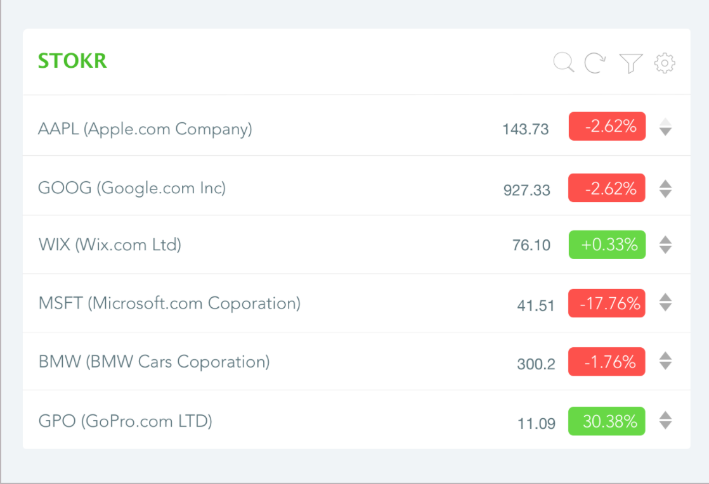

# Stokr - The Stock Ticker
> A stock ticker is a report of the price for certain securities, updated continuously throughout the trading session by the various stock exchanges. A "tick" is any change in price, whether that movement is up or down.

* [What It Does](#what-it-does)
* [Assets And Mock-ups](#assets-and-mock-ups)
* [Stocks List Page](#stocks-list-page)
	* [Header](#header)
	* [List Of Stocks](#list-of-stocks)
	* [Filter Section](#filter-section)
* [Add Stocks Page](#add-stocks-page)
	* [Header](#header-1)
	* [Candidate Stocks](#candidate-stocks)
* [Data](#data)
	* [Static Mocked Data](#static-mocked-data)
	* [Real Data - Stokr Server](#real-data---stokr-server)
	* [Storing The Data](#storing-the-data)
* [Bonus Section - Pages](#bonus-section---pages)
* [Bonus Section - API](#bonus-section---api)

## What It Does
The stock ticker displays a list of favorite stocks (portfolio) with their current value and daily change in percentages and value.

Stocks can be added or removed from the portfolio. Their order in the portfolio can be changed. The list can be filtered by some conditions.

The selected symbols should be saved locally.

The Stocks data should be updated periodically (every 5 minutes) or when triggered by the user.

There are two screens needs to be implemented - "Stocks List" and "Add Stocks".

## Assets And Mock-ups
Relevant SVG assets are supplied under the `assets` folder.

You can find all design mock ups [here](https://zpl.io/Z2wuNsg). Here's an example:

<p align="center">
  
</p>

## Stocks List Page
Display a list of selected stocks and their data from the portfolio. 

### Header
#### Components:
* Logo
* Search button
* Settings button
* Filter button
* Refresh button

#### Behavior:
* The search button changes the view to the Add Stocks view.
* The settings button toggles between Edit/View modes (more below).
* The filter button opens/closes a small section to filter visible stocks (more below). 
* The refresh button updates the stocks data.

### List of Stocks
A list of items, where each line represents stock's data.

#### Components
* Remove stock button (displayed **only** in edit mode)
* Stock symbol
* Stock name
* Current stock price
* Daily change
* Up/Down arrows (should **not** be displayed in Filter mode) 

#### Behavior

* Remove stock button should appear only in edit mode

* The `Daily Change` should toggle on click:
- Change in percentage (+0.15%)
- Change in value (+0.01)
- Capital market (6.4B) *Implement this when have using real data*

* The Up/Down arrows decides the order of the displayed stock.


### Filter Section
#### Components
* Filter inputs
* Apply button

#### Behavior 
* By default, this section is collapsed and opens when clicking on the filter button in the header.

* Filter the stocks by the following criteria:
- By Symbol/Name: a single input that filters on both symbol and name (at least one must be satisfied to display the stock).
- By Trend: A select box, selecting between All/Losing/Gaining.
- By Price Range: From __ To __ (daily percentage).

* Filters will be reflected when clicking the Apply button.

## Add Stocks Page
Search for new stocks to add by their name or symbol

### Header
#### Components
* Search Field
* Cancel Button

#### Behavior
* Cancel button should navigate back to the stocks list page.

### Empty View
* Display some message if didn't search any stock yet.
* Display an error message if search didn't return any stock.

### Candidate Stocks
A list of possible stocks. Each line represents a stock and should look like this:
#### Components
* Symbol
* Name
* Add button
* Type and Exchange name (optional)

#### Behavior
* Click the add button will add the stock to the portfolio and navigate back to the stocks list page.
* Cancel button will navigate to the stocks list screen without adding stocks.

# Data
## Static Mocked Data
As a first step, use the data structures below.

1. Stocks Symbol List. Defines which stocks needs to be displayed and their order
```json
[
  "WIX",
  "MSFT",
  "YHOO"
]
```

2. Stocks Data. Data per each symbol.
```json
[
  {
    "Symbol": "WIX",
    "Name": "Wix.com Ltd.",
    "Change": "0.750000",
    "PercentChange": "+1.51%",
    "LastTradePriceOnly": "76.099998"
  },
  {
    "Symbol": "MSFT",
    "Name": "Microsoft Corporation",
    "PercentChange": "-2.09%",
    "Change": "-0.850006",
    "LastTradePriceOnly": "69.620003"
  },
  {
    "Symbol": "YHOO",
    "Name": "Yahoo! Inc.",
    "Change": "0.279999",
    "PercentChange": "+1.11%",
    "LastTradePriceOnly": "50.599998"
  }
]
```

3. Stocks Symbol Data. When searching for partial Yahoo symbol, for example `YHO` (instead of `YHOO`), this it the data that returns:

```json
[
  {
    "exchange": "NMS",
    "exchange_name": "NASDAQ",
    "name": "Yahoo! Inc.",
    "symbol": "YHOO",
    "type": "Stock"
  },
  {
    "exchange": "MUN",
    "exchange_name": "Munich",
    "name": "YAHOO INC.  DL-,001",
    "symbol": "YHO.MU",
    "type": "Stock"
  },
  {
    "exchange": "EBS",
    "exchange_name": "Swiss",
    "name": "Yahoo! Inc.",
    "symbol": "YHOO.SW",
    "type": "Stock"
  },
  {
    "exchange": "SGO",
    "exchange_name": "Santiago Stock Exchange ",
    "name": "Yahoo! Inc.",
    "symbol": "YHOO.SN",
    "type": "Stock"
  },
  {
    "exchange": "PNK",
    "exchange_name": "OTC Markets",
    "name": "Yellowhead Mining Inc.",
    "symbol": "YHMGF",
    "type": "Stock"
  }
]
```

## Real Data - Stokr Server

To get the real data about symbols and stocks, we use the Yahoo finance platform. You're encouraged to use a pre-created NodeJS Express server that simplifies Yahoo's API.

Install the server
```
npm i -g stokr-server
```
Run the server (will run on `http://localhost:7000`)

```
stokr-server
```

In case the default key & secret don't work you can [registr a new Yahoo application](https://developer.yahoo.com/apps/) and then run the server:


```
stokr-server -k <key> -s <secret>
```

### Stokr Server API

#### Get quotes' (stocks) details by symbols
Get quotes information by symbols

* **URL** `/quotes`
* **Method:** `GET`
*  **URL Params**
   **Required:**
   `q=[string]` - Comma separated symbols
* **Success Response:**
  * **Code:** 200 <br />
  * **Content:**
  ```JSON
  {"query":{"count":2,"created":"2017-06-07T15:19:22Z","lang":"en-US","diagnostics":{"publiclyCallable":"true","url":{"execution-start-time":"8","execution-stop-time":"16","execution-time":"8","content":"http://api.finance.yahoo.com:4080/v1/quote/symbol/GOOG%2CWIX?view=detail&format=xml"},"javascript":{"execution-start-time":"5","execution-stop-time":"19","execution-time":"14","instructions-used":"2502","table-name":"pm.finance"},"user-time":"20","service-time":"8","build-version":"2.0.137"},"results":{"quote":[{"symbol":"GOOG","Name":"Alphabet Inc.","Symbol":"GOOG","Open":"979.649963","DaysHigh":"984.140015","DaysLow":"977.260010","MarketCapitalization":"683.555B","YearHigh":"988.250000","YearLow":"663.284000","Volume":"511997","AverageDailyVolume":"-","PERatio":"33.063560","LastTradePriceOnly":"978.450012","Change":"1.880005","realtime_price":"978.450012","realtime_change":"1.880005","realtime_chg_percent":"0.192511","eps_curr_year":"29.593000","realtime_ts":"6 07 2017 15:19:00 GMT","ts":"6 07 2017 15:19:00 GMT"},{"symbol":"WIX","Name":"Wix.com Ltd.","Symbol":"WIX","Open":"77.750000","DaysHigh":"79.500000","DaysLow":"77.449997","MarketCapitalization":"3.591B","YearHigh":"86.150000","YearLow":"26.310000","Volume":"411468","AverageDailyVolume":"-","PERatio":null,"LastTradePriceOnly":"79.000000","Change":"1.250000","realtime_price":"79.000000","realtime_change":"1.250000","realtime_chg_percent":"1.607717","eps_curr_year":"-1.110000","realtime_ts":"6 07 2017 15:18:01 GMT","ts":"6 07 2017 15:18:01 GMT"}]}}}
  ```
* **Sample Call:** `/quotes?q=GOOG,WIX`

#### Search Symbol
Search a quote (stock) symbol by company name or any free text

* **URL** `/search`
* **Method:** `GET`
*  **URL Params**
   **Required:**
   `q=[string]` - search query
* **Success Response:**
  * **Code:** 200 <br />
  * **Content:**
  ```JSON
  {"ResultSet":{"Query":"GOOG","Result":[{"symbol":"GOOG","name":"Alphabet Inc.","exch":"NMS","type":"S","exchDisp":"NASDAQ","typeDisp":"Equity"},{"symbol":"GOOGL","name":"Alphabet Inc.","exch":"NAS","type":"S","exchDisp":"NASDAQ","typeDisp":"Equity"},{"symbol":"GOOGL-USD.SW","name":"Alphabet","exch":"EBS","type":"S","exchDisp":"Swiss","typeDisp":"Equity"},{"symbol":"GOOGL170609C01000000","name":"GOOGL Jun 2017 call 1000.000","exch":"OPR","type":"O","exchDisp":"OPR","typeDisp":"Option"},{"symbol":"GOOG190118C01000000","name":"GOOG Jan 2019 call 1000.000","exch":"OPR","type":"O","exchDisp":"OPR","typeDisp":"Option"},{"symbol":"GOOG170609C00985000","name":"GOOG Jun 2017 call 985.000","exch":"OPR","type":"O","exchDisp":"OPR","typeDisp":"Option"},{"symbol":"GOOG170609C00980000","name":"GOOG Jun 2017 call 980.000","exch":"OPR","type":"O","exchDisp":"OPR","typeDisp":"Option"},{"symbol":"GOOG170609C00982500","name":"GOOG Jun 2017 call 982.500","exch":"OPR","type":"O","exchDisp":"OPR","typeDisp":"Option"},{"symbol":"GOOG170609P00960000","name":"GOOG Jun 2017 put 960.000","exch":"OPR","type":"O","exchDisp":"OPR","typeDisp":"Option"},{"symbol":"GOOGL.SN","name":"Alphabet Inc.","exch":"SGO","type":"S","exchDisp":"Santiago Stock Exchange","typeDisp":"Equity"}]}}
  ```
* **Sample Call:** `/search?q=google`

### Storing the data
You should use the `LocalStorage` mechanism to save your portfolio's stocks and their order.
When the app start - use the data from the `LocalStorage`. If there isn't data there, use the "Stocks Symbol List" data defined previously in the mocked data.


# Bonus Section - Pages
## Animations
* When moving between screens.
* When list items appear.

## Stocks List Page
* Filter the stocks in the Stocks List screen without clicking on the apply button (on-the-fly filtering)

## Add Stocks Page
* Search for stocks without clicking on the search button (on-the-fly filtering). Beware from making multiple HTTP requests.
* Allow adding multiple stocks at once.

## Stock Detail Page (Bonus)
This screen is up to you to implement. It should display additional data of a specific stock.
For example, latest news about the stack / more numerical data / change graph, etc... Go wild!

# Bonus Section - API
* Save portfolio stocks in the server (instead of using `LocalStorage`) by using the following API:

## List Saved Symbols
Lists the saved symbols (notice: the server is not persistent so the list will be lost when you restart it).

* **URL** `/symbol`
* **Method:** `GET`
* **Success Response:**
  * **Code:** 200 <br />
  * **Content:**
  ```JSON
  ["MSFT","AAPL","GOOG","CSCO","ORCL","INTC","WIX","AMZN","EBAY","DELL","QCOM","YHOO"]
  ```
* **Sample Call:** `/symbol`

## Save Symbol
Saves a new symbol.

* **URL** `/symbol/:symbol`
* **Method:** `POST`
*  **URL Params**
   **Required:**
   `:symbol` - The symbol to save
* **Success Response:**
  * **Code:** 200 <br />
  * **Content:**
  ```JSON
  true
  ```
* **Error Response:**
  * i.e. cannot add the same symbol twice (case insensitive)
  * **Code:** 500 <br />
* **Sample Call:** `/symbol/WIX`

## Remove a Symbol
Removes the symbol from the server memory

* **URL** `/symbol/:symbol`
* **Method:** `DELETE`
*  **URL Params**
   **Required:**
   `:symbol` - The symbol to remove
* **Success Response:**
  * **Code:** 200 <br />
  * **Content:**
  ```JSON
  true
  ```
* **Error Response:**
  * i.e. the symbol to remove was not found
  * **Code:** 500 <br />
* **Sample Call:** `/symbol/GOOG` 
